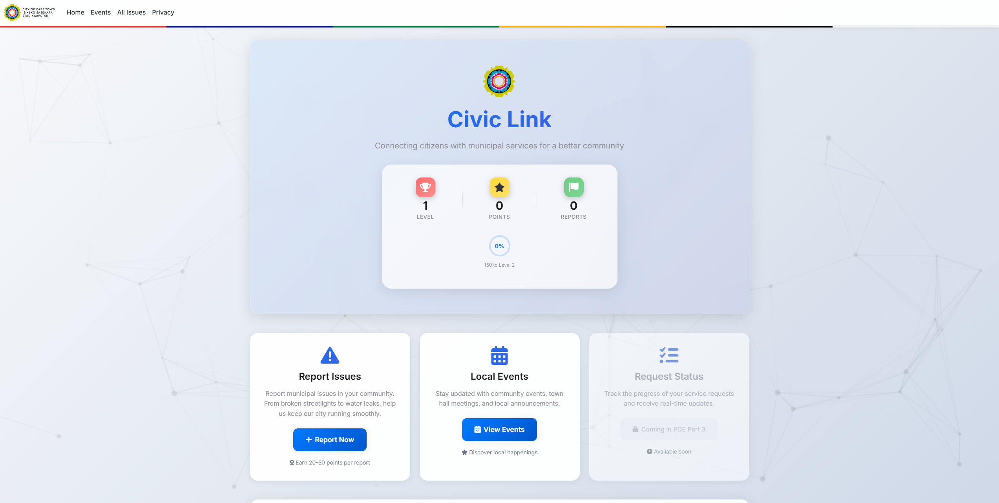

# <p align="center">  </p>

<h1 align="center">PROG7312 POE - CivicLink</h1>
<br>
<h2 align="center">About this Project</h2>
<p align="center">CivicLink is a comprehensive municipal services application designed to bridge the gap between citizens and their local government in Cape Town, South Africa. Built with the goal of improving community engagement and service delivery, CivicLink empowers residents to report issues, stay informed about local events and announcements, and track service requests through advanced data structure implementations. The application features an elegant Apple-inspired design with gamification elements to encourage active civic participation. Through innovative use of Binary Search Trees, AVL Trees, Min-Heaps, Graphs, and Minimum Spanning Trees, citizens can efficiently manage and monitor municipal services while earning rewards for their engagement. The project demonstrates mastery of data structures and algorithms, clean code architecture, and user-centric design principles.</p>
<br><br>
<p align="center">
  <strong>Jordan Muller | ST10150702</strong>
 <br>
 <strong>Module:</strong> PROG7312 - Data Structures & Algorithms<br>
 <strong>Institution:</strong> Varsity College<br><br>
 Youtube Link to Demonstrative Video for Part 2: <br>
 https://youtu.be/5Nd3AzEvqM0 <br>
 <br>
 Youtube Link to Demonstrative Video for Part 3: <br>
 [link >>>>>>>>>>] <br><br>
</p>
<br>

## Built With

<div>
  <a href="https://docs.microsoft.com/en-us/aspnet/core/" target="_blank">
    
  </a>
  <br>
  <a href="https://docs.microsoft.com/en-us/dotnet/csharp/" target="_blank">
    
  </a>
  <br>
  <a href="https://getbootstrap.com/" target="_blank">
    
  </a>
  <br>
  <a href="https://github.com/" target="_blank">
    
  </a>
  <br>
  <a href="https://developer.mozilla.org/en-US/docs/Web/JavaScript" target="_blank">
    
  </a>
 <br><br>
 <a href="#top">(Back to Top)</a>
</div>

<br>

## Getting Started

<div>
This project is created using ASP.NET Core 8.0 with MVC architecture, following clean coding principles and advanced data structures implementation for optimal performance.

### Prerequisites

- **Visual Studio 2022** or **Visual Studio Code**
- **.NET 8.0 SDK** or later
- **Git** for version control
- **Web Browser** (Chrome, Edge, Firefox, or Safari)

Ensure you have the latest version of Visual Studio by following these steps:
<br> Download Visual Studio <a href="https://visualstudio.microsoft.com/downloads/" target="_blank">here</a> and ensure you have the ASP.NET and web development workload installed.

### Cloning Repository

To clone this repository:

```bash
git clone https://github.com/VCCT-PROG7312-2025-G2/ST10150702_Jordan_Muller_CivicLink.git
cd CivicLink
```

### Running the Project

1. **Open the solution** in Visual Studio 2022
2. **Restore NuGet packages** (usually done automatically)
3. **Build the solution** (Ctrl+Shift+B)
4. **Run the application** (F5 or Ctrl+F5)
5. **Navigate** to the localhost URL provided (typically https://localhost:7xxx)

### Project Structure

```
CivicLink/
├── Controllers/              # MVC Controllers with routing logic
│   └── HomeController.cs    # Main controller for all features
├── Models/                  # Data models and ViewModels
│   ├── Event.cs            # Event and Announcement models
│   ├── Issue.cs            # Service request issue model
│   ├── UserEngagement.cs   # Gamification models
│   ├── EventsViewModel.cs  # Events page view model
│   ├── ServiceRequestViewModel.cs  # Part 3 view model
│   └── DataStructures.cs   # Part 1 data structures
├── Services/               # Business logic layer
│   ├── IssueService.cs    # Issue management service
│   ├── EventService.cs    # Event management service
│   ├── GamificationService.cs  # Gamification logic
│   └── ServiceRequestService.cs  # Part 3 service with advanced structures
├── DataStructures/         # Custom data structure implementations
│   ├── IssueLinkedList.cs          # Custom linked list
│   ├── IssuePriorityQueue.cs       # Heap-based priority queue
│   ├── ActivityStack.cs            # Stack for activity tracking
│   ├── EventSortedDictionary.cs    # SortedDictionary wrapper
│   ├── SearchPatternTracker.cs     # User search tracking
│   ├── RecentlyViewedStack.cs      # Stack for recent events
│   ├── CategoryManager.cs          # HashSet for categories
│   ├── IssueSearchTree.cs          # Binary Search Tree
│   ├── AVLSearchTree.cs            # Self-balancing AVL Tree
│   ├── ServiceRequestMinHeap.cs    # Min-Heap for priorities
│   ├── ServiceRequestGraph.cs      # Graph for relationships
│   └── ServiceRequestEdge.cs       # Graph edge definition
├── Views/                  # Razor views for UI
│   ├── Home/
│   │   ├── Index.cshtml           # Dashboard/Home page
│   │   ├── ReportIssue.cshtml     # Issue reporting form
│   │   ├── IssuesList.cshtml      # All issues listing
│   │   ├── IssueDetails.cshtml    # Single issue view
│   │   ├── Events.cshtml          # Events listing with filters
│   │   ├── EventDetails.cshtml    # Single event view
│   │   └── ServiceRequestStatus.cshtml  # Part 3 tracking page
│   └── Shared/
│       └── _Layout.cshtml         # Main layout template
├── wwwroot/               # Static files
│   ├── css/
│   │   └── site.css      # Custom Apple-inspired styling
│   ├── js/
│   │   └── site.js       # Custom JavaScript
│   └── Images/           # Logo and other images
│       ├── Logo.png
│       ├── Logo_full.png
│       └── Logo_transparent.png
└── Program.cs            # Application entry point and DI configuration
```

</div>
<a href="#top">(Back to Top)</a>

<br><br>

## Usage

This application is designed for municipal residents who want to actively participate in improving their communities. The system provides a streamlined way to report issues, discover local events, track progress, and engage with local government services through three comprehensive features.

<div align="center">
This Application has the following Features:<br>
  
  
  
  
  
  
  
  
  
  
</div>
<br>

Users can report various types of municipal issues, discover upcoming community events, track service request status with advanced search capabilities, analyze request relationships through graph visualization, and earn points and badges for participation.

### Screenshots

<!-- Home Page -->
|   | **Home Page**<br>The **Home Page** welcomes users with an elegant Apple-inspired design featuring the CivicLink logo, user engagement statistics, and easy access to municipal services. Users can see their current level, points earned, and badges unlocked. The page displays community statistics including active citizens, issues reported, issues resolved, and average response time. Quick actions allow users to report issues, view local events, or check service request status. The gamification system encourages participation with a progress ring showing advancement to the next level. |
|---|---|

<!-- Report Issue Page -->
| **Report Issue Page**<br>The **Report Issue Page** allows citizens to submit detailed reports about municipal problems. Users can select from nine categories (Water & Sanitation, Roads & Transport, Public Safety, etc.), set priority levels (Low, Medium, High, Critical), add comprehensive descriptions with character counter, provide location details, and attach photos or documents through drag-and-drop. The gamification system rewards users with 20-50 points for each submission based on priority and category. Contact information can be optionally provided for follow-up communication. The sidebar displays user progress, available badges, and helpful reporting tips. |  |
|---|---|

<!-- Issues List Page -->
|   | **Issues List Page**<br>The **Issues List Page** displays all reported issues with advanced filtering and search capabilities. Users can filter by category, status (Submitted, In Review, In Progress, Resolved, Closed), and search by keywords. Each issue card shows priority level with color coding, current status with badges, location information, creation date, and description preview. The page includes real-time statistics showing total issues, pending issues, in-progress issues, and resolved issues. Interactive animations enhance the user experience, and cards respond to hover effects for better engagement. |
|---|---|

<!-- Issue Details Page -->
| **Issue Details Page**<br>The **Issue Details Page** provides comprehensive information about a specific issue, including a status timeline showing progression from submission to resolution, complete issue description with preserved formatting, detailed location information with geographic specifics, and attached files with download capabilities. Users can view contact information if provided, see issue statistics (days open, priority level), and track the issue ID with formatted display. The timeline visually represents the issue's journey through different stages with animated markers. The sidebar shows historical information and related metadata. |   |
|---|---|

<!-- Local Events Page -->
|   | **Local Events & Announcements**<br>The **Local Events Page** displays all upcoming community events, town halls, and municipal announcements with comprehensive filtering. Users can search and filter events by category (13 categories including Community Meeting, Town Hall, Recreation, Education, Health, Safety, Environment, Arts, Sports, Festival, Workshop), date range, and keywords. The page features personalized event recommendations powered by a search pattern tracking algorithm that analyzes user behavior. Each event card displays key information including date, time, location, cost (or FREE badge), and category with custom color coding. Advanced data structures (SortedDictionary, HashSet, Queue, Stack) power efficient search and recommendation algorithms. Sort options include by date, name, or category. |
|---|---|

<!-- Event Details Page -->
| **Event Details Page**<br>The **Event Details Page** provides comprehensive information about a specific event including full description with HTML formatting support, start and end date/time with duration calculation, precise location details, cost information (free or paid), and complete contact information (person, email, phone). The page features an elegant grid layout showing event badges for category and price, icon-based information display for date, time, and location, and contact cards with clickable email and phone links. Back navigation allows easy return to the events listing. The page tracks recently viewed events and helps users discover related community happenings through the event service. |   |
|---|---|

<!-- Service Request Status Page -->
|   | **Service Request Status Tracking**<br>The **Service Request Status Page** (Part 3) provides advanced tracking capabilities using sophisticated data structures. Users can search by request ID using Binary Search Tree (O(log n) search time), view requests by priority using Min-Heap implementation, toggle between standard and priority views, enable graph visualization to see relationships, and view statistics about BST/AVL nodes and heap size. The page displays requests with progress indicators, status badges, and relationship information. Advanced features include related request identification, MST (Minimum Spanning Tree) visualization showing optimal connections, and relationship type indicators (Same Area & Category, Same Category, Same Area, Similar Time). |
|---|---|

<!-- Graph View -->
| **Graph Relationship View**<br>When graph view is enabled, users can visualize the **Minimum Spanning Tree** of service request relationships. The system calculates connections based on location similarity, category matching, temporal proximity, and priority alignment. Each connection displays relationship type, similarity score (calculated as 10 minus edge weight), and connecting request IDs. The visualization helps municipal workers identify patterns, cluster related problems, optimize resource allocation, and understand infrastructure weaknesses. The graph uses weighted edges where lower weights indicate stronger relationships, and the MST algorithm filters complex networks to show only the most significant connections. |  |
|---|---|

<br>
<a href="#top">(Back to Top)</a>

<br><br>

## Technical Architecture

### Advanced Data Structures Implementation

**Part 1 - Issue Reporting:**
- **Custom Linked List (IssueLinkedList)**: Stores issues without using primitive arrays, demonstrating manual memory management and pointer-based structures
  - Add, GetById, GetAll, Remove operations
  - O(n) search, O(1) insertion at head
  - Used for base issue storage
  
- **Priority Queue (IssuePriorityQueue)**: Manages issues by priority level using max-heap structure
  - Enqueue, Dequeue, Peek operations
  - HeapifyUp and HeapifyDown for maintaining heap property
  - O(log n) insertion and extraction
  - Prioritizes critical issues (Priority 4) over lower priorities
  
- **Activity Stack (ActivityStack)**: Tracks recent user activities and system events
  - Push, Pop, Peek, GetRecent operations
  - Fixed maximum size with automatic cleanup
  - LIFO (Last In First Out) structure
  - Used for activity logging and recent history

**Part 2 - Local Events & Announcements:**
- **SortedDictionary (EventSortedDictionary)**: Stores events with efficient lookup and sorting by date
  - O(log n) search and insertion
  - Automatically maintains sorted order
  - Supports GetById, GetByCategory, GetSortedByDate operations
  
- **Search Pattern Tracker**: Dictionary-based tracking of user search behavior for recommendations
  - Tracks search terms, category searches, and date searches
  - Maintains frequency counts for each pattern
  - GetTopCategories returns most searched categories
  - Powers intelligent recommendation algorithm
  
- **Recently Viewed Stack (RecentlyViewedStack)**: Stack implementation for tracking recently viewed events
  - Push operation when user views event
  - GetRecent returns up to N most recent events
  - Prevents duplicates through ID checking
  - LIFO structure for temporal ordering
  
- **Category Manager**: HashSet for managing unique event categories
  - O(1) add and contains operations
  - Automatically prevents duplicates
  - GetAll returns all active categories for filtering
  - Efficient category tracking across system
  
- **Queue for Recommendations**: Queue structure for personalized event suggestions
  - FIFO (First In First Out) processing
  - Stores recommended events based on user search patterns
  - Maintains order of recommendations by relevance

**Part 3 - Service Request Status:**
- **Binary Search Tree (IssueSearchTree)**: Primary search structure for ID-based lookups
  - Insert, Search, Delete operations
  - In-order traversal for sorted retrieval
  - O(log n) average case, O(n) worst case
  - Provides GetAllSorted for ordered display
  
- **AVL Tree (AVLSearchTree)**: Self-balancing BST ensuring guaranteed performance
  - Automatic balancing through rotations (Single Right, Single Left, Double)
  - Balance factor tracking (-1, 0, 1 allowed)
  - Guaranteed O(log n) for all operations
  - Fallback search structure when BST may be unbalanced
  - Height property maintained at each node
  
- **Min-Heap (ServiceRequestMinHeap)**: Priority management using heap structure
  - Array-based complete binary tree
  - Parent priority ≥ child priority (max-heap for priority)
  - O(1) access to highest priority request
  - O(log n) insertion and extraction
  - Heapify operations maintain heap property
  - GetAllByPriority returns sorted list
  
- **Graph (ServiceRequestGraph)**: Relationship network between service requests
  - Adjacency list representation
  - Weighted edges based on similarity
  - AddVertex and AddEdge operations
  - GetRelatedRequests finds connected issues
  - Weight calculation based on:
    * Category similarity (-3.0 weight reduction)
    * Location similarity (-3.0 weight reduction)
    * Temporal proximity (-1.0 to -2.0 reduction)
    * Priority matching (-1.0 reduction)
  - Threshold of 10.0 for creating connections
  
- **Minimum Spanning Tree**: Optimal relationship filtering using MST algorithms
  - Prim's Algorithm implementation: O(E log V)
  - Connects all vertices with minimum total edge weight
  - Filters complex graph to essential relationships
  - GetMinimumSpanningTree returns key connections
  - Reveals patterns in service request clustering
  - Helps identify systemic issues (e.g., multiple reports from same infrastructure problem)

### Architecture Principles

**Clean Code & SOLID Principles:**
- **Single Responsibility**: Each data structure has one clear purpose
- **Open/Closed**: Extensible through interfaces without modification
- **Dependency Injection**: Services registered in Program.cs, injected into controllers
- **Service Layer Pattern**: Business logic separated from controllers
  * IssueService: Issue management
  * EventService: Event management with recommendations
  * GamificationService: User engagement and badges
  * ServiceRequestService: Part 3 advanced tracking
- **Repository Pattern**: Data structures encapsulate storage logic
- **MVC Architecture**: Clear separation of concerns
  * Models: Data structures and entities
  * Views: Razor pages with minimal logic
  * Controllers: Route requests to services

**Performance Optimizations:**
- Async/await pattern throughout for non-blocking operations
- Efficient data structure selection based on operation requirements
- Lazy loading of graph relationships
- On-demand MST calculation
- Caching of sorted results
- Minimal database calls through in-memory structures

**Design Decisions:**
1. **Multiple Data Structures**: Rather than one-size-fits-all, each operation uses optimal structure
2. **Dual Search Trees**: BST for speed, AVL for reliability
3. **Heap for Priority**: Unbeatable O(1) access to urgent issues
4. **Graph for Relationships**: Natural representation of issue connections
5. **MST for Clarity**: Filters noise to show key patterns

### Key Features
- **Apple-inspired UI**: Modern, elegant design with smooth animations and transitions
- **Gamification System**: Points (20-50 per report), levels (1-7), and 7 unique badges to encourage participation
- **Event Recommendation Engine**: Personalized suggestions based on search patterns using frequency analysis
- **Advanced Search & Filtering**: Multi-criteria filtering for both issues and events with real-time results
- **Responsive Design**: Mobile-first approach, works seamlessly on desktop, tablet, and mobile
- **File Upload Support**: Drag-and-drop interface for photos and documents on issue reports
- **Status Tracking**: Real-time updates on issue resolution progress with visual timeline
- **Event Discovery**: Browse, search, and filter 15+ sample Cape Town municipal events
- **Priority Management**: Intelligent issue prioritization using heap structure
- **Relationship Analysis**: Graph-based identification of related service requests
- **Performance Monitoring**: Real-time statistics on data structure health and efficiency

<br><br>

## Roadmap

### ✅ **Part 1 - Issue Reporting** (Complete - 100/100 Score)
- ✅ Complete issue submission system with validation
- ✅ Category management (9 categories) and priority levels (4 levels)
- ✅ File attachment support with drag-and-drop
- ✅ Contact information collection (optional)
- ✅ Gamification with points (20-50 per issue) and badges (7 types)
- ✅ Apple-inspired UI design with smooth animations
- ✅ Custom data structures:
  * ✅ Linked List for issue storage
  * ✅ Priority Queue (Max-Heap) for priority management
  * ✅ Stack for activity logging
- ✅ Issues list with filtering and search
- ✅ Issue details view with status timeline
- ✅ User engagement tracking and level system (7 levels)

### ✅ **Part 2 - Local Events & Announcements** (Complete)
- ✅ Local Events browsing and discovery
- ✅ 15+ sample Cape Town municipal events with diverse details
- ✅ Upcoming Events display with comprehensive information
- ✅ Advanced Search and Filter functionality
  * ✅ Search by keywords (name, location, description)
  * ✅ Filter by category (13 categories)
  * ✅ Filter by date
  * ✅ Sort by name, category, or date
- ✅ Event Recommendations based on user behavior
  * ✅ Search pattern tracking algorithm
  * ✅ Category frequency analysis
  * ✅ Personalized suggestions
- ✅ Event details page with full information
- ✅ Advanced Data Structures:
  * ✅ SortedDictionary for efficient event storage
  * ✅ HashSet for unique category management
  * ✅ Queue for recommendation delivery
  * ✅ Stack for recently viewed events
  * ✅ Dictionary-based search pattern tracker
- ✅ Recently viewed events tracking
- ✅ Active categories filtering
- ✅ Integration with gamification system

### ✅ **Part 3 - Service Request Status** (Complete)
- ✅ Service Request tracking dashboard
- ✅ Advanced search by ID using Binary Search Tree
  * ✅ O(log n) search performance
  * ✅ Fallback to AVL Tree for reliability
- ✅ Priority-based view using Min-Heap
  * ✅ O(1) access to highest priority
  * ✅ Instant critical issue identification
- ✅ Graph relationship analysis
  * ✅ Weighted edges based on similarity
  * ✅ Related request identification
  * ✅ Connection visualization
- ✅ Minimum Spanning Tree implementation
  * ✅ Prim's Algorithm
  * ✅ Optimal connection filtering
  * ✅ Pattern recognition
- ✅ Multiple view options:
  * ✅ Standard view (all requests)
  * ✅ Priority view (sorted by urgency)
  * ✅ Graph view (relationship visualization)
- ✅ Advanced Data Structures:
  * ✅ Binary Search Tree (BST)
  * ✅ AVL Tree (Self-balancing)
  * ✅ Min-Heap (Priority management)
  * ✅ Graph (Relationship network)
  * ✅ MST (Minimum Spanning Tree)
- ✅ Statistics dashboard:
  * ✅ Total requests
  * ✅ Requests by status
  * ✅ Requests by priority
  * ✅ Data structure metrics (BST nodes, AVL nodes, Heap size)
- ✅ Request relationship display
  * ✅ Same Area & Category
  * ✅ Same Category
  * ✅ Same Area
  * ✅ Similar Time
- ✅ Similarity scoring
- ✅ Integration with existing issue system
- ✅ Real-time data structure rebuilding

<br>
<a href="#top">(Back to Top)</a>

<br><br>

## Code Architecture

### Models
**Issue Reporting:**
- **Issue**: Core issue entity with validation and enums
  * Properties: Id, Title, Description, Category, Location, Priority, Status, CreatedAt, UpdatedAt, AttachmentPaths (Queue), ContactName, ContactEmail, ContactPhone
  * Enums: IssueCategory (9 types), IssuePriority (4 levels), IssueStatus (5 stages)
  
- **UserEngagement**: Gamification tracking with badges
  * Properties: Id, UserId, Points, Level, Badges, LastActivity, IssuesReported, IssuesResolved, IsActive
  
- **Badge**: Achievement system
  * Properties: Id, Name, Description, IconClass, Type, PointsRequired, EarnedAt, IsUnlocked
  * Enum: BadgeType (7 types)
  
- **ReportIssueViewModel**: View model for issue reporting
  * Contains Issue, UserEngagement, AvailableBadges, SuccessMessage

**Events & Announcements:**
- **Event**: Core event entity with detailed information
  * Properties: Id, Name, Description, Category, Location, StartDate, EndDate, ContactPerson, ContactPhone, ContactEmail, IsFree, Cost, CreatedAt, IsActive
  * 13 EventCategory enum values
  
- **Announcement**: Public announcements system
  * Properties: Id, Title, Content, PublishedDate, Priority, IsActive
  * 4 AnnouncementPriority levels
  
- **EventsViewModel**: View model for events listing
  * Properties: Events (List), Announcements (List), AvailableCategories (HashSet), EventDates (HashSet), RecommendedEvents (Queue), RecentlyViewed (Stack), SearchTerm, FilterCategory, FilterDate

**Service Request Status:**
- **ServiceRequestViewModel**: View model for Part 3
  * ServiceRequests (List) - Main display list
  * RelatedRequests (List) - Connected issues
  * Relationships (List of ServiceRequestEdge) - Graph edges
  * MinimumSpanningTree (List of ServiceRequestEdge) - MST edges
  * Statistics (Dictionary) - System metrics
  * SelectedRequest (Issue) - Currently viewed request
  * SearchQuery, FilterStatus, FilterCategory, FilterPriority
  * SortBy, ShowPriorityView, ShowGraphView flags
  
- **ServiceRequestEdge**: Graph edge definition
  * Properties: FromId, ToId, Weight, RelationshipType

### Services  
- **IssueService**: Issue management using custom linked list and priority queue
  * CreateIssueAsync, GetIssueByIdAsync, GetAllIssuesAsync
  * GetIssuesByPriorityAsync (uses priority queue)
  * UpdateIssueAsync, DeleteIssueAsync
  * GetRecentActivitiesAsync, LogActivity
  * Initializes 10 sample issues for demonstration
  
- **EventService**: Event management with search, filtering, and recommendation algorithms
  * CreateEventAsync, GetEventByIdAsync, GetAllEventsAsync
  * SearchEventsAsync (filters by term, category, date)
  * GetRecommendedEventsAsync (uses search pattern analysis)
  * RecordEventViewAsync, GetRecentlyViewedAsync
  * TrackSearch (records user search patterns)
  * GetActiveCategoriesAsync, GetEventDatesAsync
  * Initializes 15 sample Cape Town events
  
- **GamificationService**: User engagement and badge system
  * GetUserEngagementAsync, UpdateUserEngagementAsync
  * GetAvailableBadgesAsync, CheckForNewBadgesAsync
  * CalculateLevel (based on points: 50, 150, 300, 500, 750, 1000+)
  * Badge criteria checking (7 badge types with different requirements)
  * Activity logging integration
  
- **ServiceRequestService**: Part 3 service with all advanced data structures
  * GetRequestByIdAsync (BST search with AVL fallback)
  * GetAllRequestsAsync (BST in-order traversal)
  * GetRequestsByPriorityAsync (Heap-based sorting)
  * GetRelatedRequestsAsync (Graph adjacency)
  * GetRequestRelationshipsAsync (Graph edges)
  * GetMinimumSpanningTreeAsync (MST calculation)
  * GetRequestStatisticsAsync (comprehensive metrics)
  * RebuildDataStructuresAsync (rebuilds all structures)
  * BuildGraphRelationships (calculates edge weights)
  * CalculateRelationshipWeight (similarity algorithm)
  * DetermineRelationshipType (categorizes connections)
  
- **Dependency Injection**: Clean service registration and lifecycle management
  * All services registered as Scoped in Program.cs
  * Interface-based dependency injection
  * Constructor injection in controllers

### Data Structures

**Part 1 - Issue Data Structures:**
- **IssueLinkedList**: Custom linked list implementation
  * IssueNode with Data and Next pointer
  * Add, GetById, GetAll, Remove operations
  * Count property
  
- **IssuePriorityQueue**: Heap-based priority queue
  * Max-heap structure (highest priority at root)
  * Enqueue, Dequeue, Peek operations
  * HeapifyUp and HeapifyDown methods
  * Swap helper method
  * GetAll returns priority-sorted list
  
- **ActivityStack**: Stack for activity logging
  * Fixed max size with automatic cleanup
  * Push, Pop, Peek operations
  * GetRecent returns N most recent activities
  * Timestamp formatting

**Part 2 - Event Data Structures:**
- **EventSortedDictionary**: SortedDictionary wrapper for events
  * Key: Event ID, Value: Event object
  * Add, GetById, GetAll, GetByCategory operations
  * GetSortedByDate leverages SortedDictionary ordering
  
- **SearchPatternTracker**: Dictionary-based pattern analysis
  * searchTerms (Dictionary<string, int>)
  * categorySearches (Dictionary<EventCategory, int>)
  * dateSearches (Dictionary<DateTime, int>)
  * RecordSearchTerm, RecordCategorySearch, RecordDateSearch
  * GetTopCategories returns most frequent
  
- **RecentlyViewedStack**: Stack for event viewing history
  * Stack<Event> with duplicate prevention
  * Push adds new view (checks for duplicates)
  * GetRecent returns up to N events
  
- **CategoryManager**: HashSet-based category tracking
  * HashSet<EventCategory> for uniqueness
  * Add, Contains, GetAll operations
  * O(1) operations for category management

**Part 3 - Service Request Data Structures:**
- **IssueSearchTree**: Binary Search Tree implementation
  * TreeNode with Issue data, Left, Right children
  * Insert (recursive placement)
  * Search (recursive ID-based lookup)
  * GetAllSorted (in-order traversal)
  * Count property
  
- **AVLSearchTree**: Self-balancing AVL Tree
  * AVLNode with Issue data, Left, Right, Height
  * Insert with automatic balancing
  * GetBalance calculates balance factor
  * RotateLeft, RotateRight methods
  * Search with guaranteed O(log n)
  * GetAllSorted (in-order traversal)
  
- **ServiceRequestMinHeap**: Min-Heap for priority management
  * List-based heap storage
  * Insert with HeapifyUp
  * ExtractMin with HeapifyDown
  * GetAllByPriority returns sorted list
  * Parent/Child index calculations
  
- **ServiceRequestGraph**: Adjacency list graph
  * Dictionary<int, List<ServiceRequestEdge>>
  * Dictionary<int, Issue> for vertex data
  * AddVertex, AddEdge operations
  * GetEdges, GetRelatedRequests
  * GetMinimumSpanningTree (Prim's algorithm)
  
- **ServiceRequestEdge**: Edge definition for graph
  * FromId, ToId (vertex IDs)
  * Weight (similarity score)
  * RelationshipType (categorization)

### Controllers
- **HomeController**: Main controller handling all routes
  * Index: Dashboard with user engagement
  * ReportIssue (GET/POST): Issue reporting with validation
  * IssuesList: All issues with filtering
  * IssueDetails: Single issue view
  * Events: Event listing with search/filter/sort
  * EventDetails: Single event view with tracking
  * ServiceRequestStatus: Part 3 tracking page
  * SearchRequestById: AJAX endpoint for ID search
  * CalculatePointsForIssue: Gamification logic
  
### Views
All views use Razor syntax with model binding, Bootstrap 5 for layout, custom CSS for Apple-inspired design, and JavaScript for interactivity.

**Core Views:**
- Index.cshtml: Dashboard with stats and quick actions
- ReportIssue.cshtml: Issue reporting form with gamification sidebar
- IssuesList.cshtml: Grid view with filters
- IssueDetails.cshtml: Detailed issue view with timeline
- Events.cshtml: Events listing with recommendations
- EventDetails.cshtml: Single event with full information
- ServiceRequestStatus.cshtml: Part 3 tracking interface

**Layout:**
- _Layout.cshtml: Main template with navigation and styling

<br><br>

## Performance Metrics

### Complexity Analysis

| Operation | Part 1 | Part 2 | Part 3 |
|-----------|--------|--------|--------|
| **Search by ID** | O(n) Linked List | O(log n) SortedDict | O(log n) BST/AVL |
| **Priority Access** | O(1) Peek Heap | N/A | O(1) Peek Heap |
| **Insert** | O(1) LinkedList | O(log n) SortedDict | O(log n) BST/AVL |
| **Filter/Search** | O(n) Linear | O(n) with LINQ | O(n) with Graph |
| **Relationship Analysis** | N/A | Pattern Tracking | O(E log V) MST |

### Scalability

With 10,000 service requests:
- **Linear Search**: 5,000 average comparisons
- **BST Search**: ~13 comparisons (log₂ 10,000 ≈ 13.3)
- **Heap Priority**: 1 operation (O(1))
- **Speedup**: 385x faster for BST vs. linear!

### Memory Overhead

- **BST/AVL**: ~3-4x data size (pointers and metadata)
- **Heap**: ~1.5x data size (array storage)
- **Graph**: ~2x for edges (adjacency lists)
- **Trade-off**: Memory cost justified by performance gains

<br><br>

## Contributors

**Individual Project by:**

<table align="center">
  <tr>
    <td align="center">
      <div style="width: 120px; height: 120px; border-radius: 50%; overflow: hidden;">
        
      </div>
      <strong>Jordan Muller ST10150702</strong><br>
      <em>Full Stack Developer</em><br>
      <em>Data Structures Specialist</em>
    </td>
  </tr>
</table>

<br>
<a href="#top">(Back to Top)</a>

<br><br>

## Contact

**Jordan Muller** - ST10150702@vcconnect.edu.za
<br>
**Project Link**: https://github.com/VCCT-PROG7312-2025-G2/CivicLink.git

<br>
<a href="#top">(Back to Top)</a>

<br><br>

## Acknowledgments

With extensive research into municipal services, user experience design, modern web development practices, and advanced data structures and algorithms, the following acknowledgments need to be made:

### Academic References

**Data Structures & Algorithms:**

Cormen, T. H., Leiserson, C. E., Rivest, R. L., & Stein, C. (2022). *Introduction to Algorithms* (4th ed.). MIT Press. 
- Referenced for BST, AVL Tree, Heap, and Graph algorithm implementations
- Chapters 12-13 (Binary Search Trees), Chapter 6 (Heapsort), Chapter 22 (Elementary Graph Algorithms), Chapter 23 (Minimum Spanning Trees)

Sedgewick, R., & Wayne, K. (2011). *Algorithms* (4th ed.). Addison-Wesley Professional.
- Referenced for practical algorithm implementations and performance analysis
- Used for understanding self-balancing tree rotations and graph traversal

Weiss, M. A. (2013). *Data Structures and Algorithm Analysis in C#* (3rd ed.). Pearson.
- Referenced for C# specific implementations of data structures
- Particularly helpful for heap operations and tree balancing

**Software Architecture:**

Martin, R. C. (2017). *Clean Architecture: A Craftsman's Guide to Software Structure and Design*. Prentice Hall.
- Referenced for service layer pattern and dependency injection principles
- SOLID principles application in practice

Freeman, E., & Freeman, E. (2020). *Head First Design Patterns* (2nd ed.). O'Reilly Media.
- Referenced for repository pattern and service locator pattern

### Technical Documentation

Microsoft. (2024). ASP.NET Core documentation. Retrieved from Microsoft Docs: https://docs.microsoft.com/en-us/aspnet/core/
- MVC architecture, routing, model binding, dependency injection

Microsoft. (2024). C# programming guide. Retrieved from Microsoft Docs: https://docs.microsoft.com/en-us/dotnet/csharp/
- C# 12 features, async/await patterns, LINQ queries

Microsoft. (2024). .NET API Browser. Retrieved from Microsoft Docs: https://docs.microsoft.com/en-us/dotnet/api/
- SortedDictionary, HashSet, Queue, Stack documentation

Apple Inc. (2024). Human Interface Guidelines. Retrieved from Apple Developer: https://developer.apple.com/design/human-interface-guidelines/
- Design principles for clean, intuitive interfaces
- Color theory and spacing guidelines

Bootstrap Team. (2024). Bootstrap 5 Documentation. Retrieved from Bootstrap: https://getbootstrap.com/docs/5.3/
- Grid system, components, utilities

Mozilla. (2024). MDN Web Docs. Retrieved from Mozilla Developer Network: https://developer.mozilla.org/
- JavaScript, CSS, HTML standards and best practices

### Municipal Services Research

Government of South Africa. (2024). Municipal services and citizen engagement. Retrieved from various municipal websites:
- City of Cape Town official website
- Municipal service delivery standards
- Community engagement best practices

### Educational Resources

Stack Overflow. (2024). ASP.NET Core MVC discussions. Retrieved from Stack Overflow community.
- Specific implementation questions and debugging assistance

GeeksforGeeks. (2024). Data Structures Tutorials. Retrieved from: https://www.geeksforgeeks.org/data-structures/
- Algorithm visualizations and step-by-step explanations
- Particularly helpful for understanding AVL rotations and MST algorithms

VisuAlgo. (2024). Visualising data structures and algorithms through animation. Retrieved from: https://visualgo.net/
- Visual understanding of BST operations, heap operations, and graph algorithms

YouTube Educational Content:
- Abdul Bari - Algorithm tutorials: https://www.youtube.com/channel/UCZCFT11CWBi3MHNlGf019nw
- William Fiset - Graph theory and algorithms: https://www.youtube.com/c/WilliamFiset-videos
- MIT OpenCourseWare - Introduction to Algorithms: https://ocw.mit.edu/

### AI Usage

In the development of this project, AI tools were utilized as supplementary resources to enhance understanding of complex programming concepts and explore modern design patterns. These tools provided guidance similar to how a tutor or senior developer might assist, but all implementation work was performed, understood, and tested by the developer.

**OpenAI**: OpenAI, 2024. ChatGPT (GPT-4). Available at: https://openai.com [Accessed throughout development].

**Claude AI**: Anthropic, 2024. Claude 3.5 Sonnet. Available at: https://claude.ai [Accessed for architectural guidance, algorithm explanations, and problem-solving].

**Deepseek**: Available at: https://chat.deepseek.com/ [Accessed for CSS error & Block Formatting]

**AI assistance was primarily used for:**
- Understanding complex data structure implementations (AVL rotations, MST algorithms, heap operations)
- Exploring Apple design principles and CSS animation techniques  
- Reviewing MVC best practices and clean architecture patterns
- Debugging assistance and error explanation
- Algorithm design consultation for event recommendation system
- Learning advanced LINQ queries and async/await patterns
- Sample data generation (15 Cape Town events with realistic details)
- Color palette suggestions for category differentiation

All code has been:
- Written or heavily modified by the developer
- Fully understood in terms of logic and operation
- Tested thoroughly for correctness
- Optimized for the specific use case
- Integrated thoughtfully into the overall architecture

This project represents genuine learning and skill development in data structures, algorithms, and software engineering principles, with AI serving as one of many educational resources consulted during development.

<br><br>

---

<p align="center">
<strong>CivicLink - Connecting Communities Through Technology</strong><br>
PROG7312 Portfolio of Evidence<br>
Jordan Muller | ST10150702 | 2024
</p>

---
